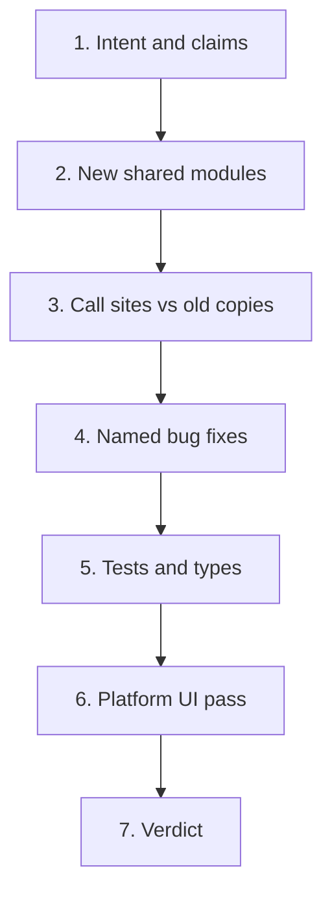

# Code review plan

This is the review plan for draft [PR #1](https://github.com/ashutoshojha-odin/shogo-ai/pull/1): **review: dedupe and de-hardcode the iPhone UI pass**.

- **Head:** `cursor/shog-742-review-dedupe-6930`
- **Base:** `fix/shog-742-ios-mobile-ui` (not `main`)
- **Size:** 30 files, +876 / −540

The PR claims to be behavior- and pixel-neutral except the named bug fixes and two search deltas. Review against the parent branch, not against `main`.

```bash
git fetch origin cursor/shog-742-review-dedupe-6930 fix/shog-742-ios-mobile-ui
git diff origin/fix/shog-742-ios-mobile-ui...origin/cursor/shog-742-review-dedupe-6930
```

## Review order

Do not read the 30-file diff top to bottom. Use this sequence:



### 1. Intent and claims

Read the PR body, then the 17 commits in order. Each commit is one extraction or one fix.

Confirm:

- Base is `fix/shog-742-ios-mobile-ui`, not `main`
- CLA check is currently failing and will block merge
- Allowed extras are only: search pad re-seed when the keyboard is closed, and sorting only the visible search tab

### 2. New shared modules

If these are wrong, every call site is wrong.

| Module | What to verify |
| --- | --- |
| [`apps/mobile/lib/native-chatgpt-theme.ts`](../apps/mobile/lib/native-chatgpt-theme.ts) | Derived RGB channels and composer tokens match the old literals. Dark `border` stays translucent `rgba(...)`, not the opaque palette border. |
| [`apps/mobile/lib/use-native-drawer-swipe.ts`](../apps/mobile/lib/use-native-drawer-swipe.ts) and [`NativeSheetDrawerShell.tsx`](../apps/mobile/components/layout/NativeSheetDrawerShell.tsx) | Shared shell keeps `(app)`'s unconditional `sheetClipStyle` and `(admin)`'s sidebar. Swipe is gated by both sheet and swipe flags. |
| [`apps/mobile/lib/use-native-composer-keyboard.ts`](../apps/mobile/lib/use-native-composer-keyboard.ts) | Search re-seeds rest pad on inset change the same way home already did. |
| [`apps/mobile/components/chat/ComposerPlusCoreSections.tsx`](../apps/mobile/components/chat/ComposerPlusCoreSections.tsx) | Mode + Environment are shared. Only `dualPlanTestId`, `environmentDisabled`, and extra sections stay at call sites. |
| [`apps/mobile/lib/native-phone-layout.ts`](../apps/mobile/lib/native-phone-layout.ts) | Named insets (`HOME_COMPOSER_MIN_BOTTOM_PAD`, sheet insets, plus-sheet height ratio) are the same numbers as before. |

### 3. Call sites: look for dropped differences

Open the old copy on the parent branch next to the new call site.

- **Drawers:** [`apps/mobile/app/(app)/_layout.tsx`](../apps/mobile/app/(app)/_layout.tsx) vs [`apps/mobile/app/(admin)/_layout.tsx`](../apps/mobile/app/(admin)/_layout.tsx). The first shared-shell commit adopted the admin clip gate; a later commit undid that. Confirm the final tree applies `sheetClipStyle` unconditionally.
- **Composers:** [`ChatInput.tsx`](../apps/mobile/components/chat/ChatInput.tsx) vs [`CompactChatInput.tsx`](../apps/mobile/components/chat/CompactChatInput.tsx). Plus-menu state lives in `useComposerPlusMenu`. `ChatInput` uses the app theme, not OS `useColorScheme`.
- **Panels:** Skills, Agents, Analytics, Logs, and Status all go through `nativePanelRootStyle`. Web vs native-phone branches must still differ the same way.
- **Sidebar filters:** [`AppSidebar.tsx`](../apps/mobile/components/layout/AppSidebar.tsx) `FilterOptionGroup` must keep Sort vs Show labels, selected state, and footer inset.
- **Desktop:** [`apps/desktop/src/main.ts`](../apps/desktop/src/main.ts) `getDesktopDevUrl()` must keep `DESKTOP_DEV_URL \|\| 'http://localhost:8081'` at all three former sites.

### 4. Named bug fixes

Treat these as product changes, not refactors.

1. **Consent notice** — [`packages/shared-ui/src/screens/LoginScreen.tsx`](../packages/shared-ui/src/screens/LoginScreen.tsx). `singleLine` only on the native panel. Web and desktop keep wrapping and underlined links.
2. **Composer theme** — `ChatInput` follows the in-app light/dark preference. Check OS dark + app light, and OS light + app dark.
3. **Folder card overflow** — [`apps/mobile/app/(app)/projects/index.tsx`](../apps/mobile/app/(app)/projects/index.tsx). Dropping `w-full` should restore `flex-1` + margin without overlapping neighbors.
4. **Search spinner** — [`apps/mobile/app/(app)/search.tsx`](../apps/mobile/app/(app)/search.tsx). `loading` starts `true`; a signed-out or unhydrated session must not spin forever.
5. **Search sort** — Counts can stay unsorted; only the visible tab's rows sort.
6. **Test mock** — [`apps/mobile/test/react-native-mock.ts`](../apps/mobile/test/react-native-mock.ts). One `useColorScheme` key, agreeing with `Appearance.getColorScheme()`.
7. **`automaticallyAdjustKeyboardInsets`** removed from `TextInput`. Keyboard avoidance must still come from the dock-pad hook.

### 5. Tests and types

PR claims: mobile suite 2281 pass / 22 fail (same as parent; failures are pre-existing SDK resolution). `tsc` 691 → 688.

```bash
bun test --cwd apps/mobile
bun test apps/mobile/lib/__tests__/native-chatgpt-theme.test.ts
bun test apps/mobile/lib/__tests__/native-phone-layout.test.ts
```

The new palette test should pin every derived Gluestack channel to the previous literal. If a value was changed rather than preserved, the test may be locking in a visual change.

Flag if these claimed fixes have no test:

- Search signed-out spinner
- `ChatInput` theme source
- `ConsentNotice` default wrapping path
- `useNativeSheetDrawer` swipe and clip gates

### 6. Platform UI pass

| Surface | What to exercise |
| --- | --- |
| iPhone | App and admin drawers; edge swipe; home and search keyboard dock; plus sheet on both composers; folder grid; login consent line |
| Web | Narrow width app-shell corner radius; wrapping consent with underlined links; folder cards; project panels |
| Desktop | Same login/consent path; Metro origin stays `localhost:8081` unless `DESKTOP_DEV_URL` is set |
| Theme | App light vs dark, including OS appearance ≠ app preference |

Edge cases: signed out on search, keyboard open then rotate, plus-sheet with environment disabled, admin vs app drawer.

### 7. Verdict

Approve only if:

- Extractions are equivalent at every former call site
- The named fixes are real and scoped
- No extra behavior leaked in beyond search pad re-seed and single-tab sort
- The palette test pins old values
- CLA is signed if this fork requires it

## Comment format

One thread per finding, severity first:

- **Blocker** — user-visible regression or wrong shared default
- **Should fix** — dropped call-site difference, or a claimed fix with no coverage
- **Nit** — naming, extra abstraction, comment drift

Review the final tree, not commit history.

## Repo checks (any PR)

From [`CONTRIBUTING.md`](../CONTRIBUTING.md):

1. CLA satisfied
2. `bun run test`
3. `bun run typecheck`
4. `bun run build`
5. Note schema, env, self-host vs cloud, and SDK impact
